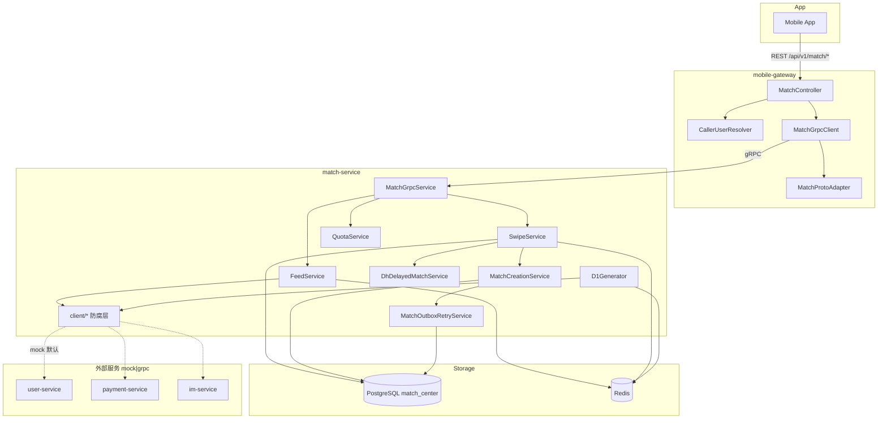

# MatchService 技术架构

## 总体链路

```text
App (JWT)
  → mobile-gateway (REST + CallerUserResolver)
    → match-service (gRPC MatchService)
      → PostgreSQL (match_center)
      → Redis (Feed / Quota / Swiped / Lock / Pref / SuperHi 幂等)
      → 外部服务防腐层 (mock 默认 | grpc 占位)
```

## Mermaid 架构图



## mobile-gateway 职责

| 职责 | 实现 |
|------|------|
| JWT 解析 callerUserId | `CallerUserResolver` |
| REST 契约 | `MatchController` 7 个端点 |
| gRPC 转发 | `MatchGrpcClient` |
| Proto ↔ VO | `MatchProtoAdapter` |
| 异常映射 | gateway 统一 Result 包装 |

**不包含**：QuotaService、SwipeHistoryManager、MatchCreationService、D1Generator 等业务类。

## match-service 职责

| 层 | 包 | 说明 |
|----|-----|------|
| gRPC 入口 | `grpc.MatchGrpcService` | 7 个 RPC |
| 业务 Service | `service.*` | Feed、Swipe、Quota、Match 查询、Visit |
| 推荐 | `recommend.*` | D0 冷启动、D1 生成、Ranker、Preference |
| 单表 Manager | `manager.*` | 禁止跨表 JOIN |
| 仓储抽象 | `repository.*` | Redis LIST/Hash/SET |
| 定时任务 | `scheduler.*` | D1QueueScheduler、MatchOutboxRetryScheduler |
| 防腐层 | `client.*` | mock / grpc 双实现 |

## 防腐层设计

```text
CandidateClient          → MockCandidateClient | UserServiceCandidateClient
TargetUserTypeResolver   → MockTargetUserTypeResolver | UserServiceTargetUserTypeResolver
SubscriptionClient       → MockSubscriptionClient | SubscriptionGrpcClient
PaymentClient            → MockPaymentClient | PaymentGrpcClient
ImClient                 → MockImClient | ImGrpcClient
```

切换：`app.match.external.user-client-mode` / `payment-client-mode` / `im-client-mode`（`mock` | `grpc`）。

## Redis 使用

| 结构 | Key 模式 | 用途 |
|------|----------|------|
| LIST | `yanshuqi:match:feed:<userId>` | Feed 队列 LPOP/RPUSH |
| Hash | `yanshuqi:match:quota:<userId>:<yyyyMMdd>` | 每日配额 cards/left/right/superHi |
| SET | `yanshuqi:match:swiped:<userId>` | 已 swipe 用户二次过滤 |
| String(JSON) | `yanshuqi:match:pref:<userId>` | D1 偏好缓存 |
| String | `yanshuqi:match:superhi:req:<userId>:<clientRequestId>` | SuperHi 幂等 |
| Lock | `yanshuqi:lock:match:swipe:*` / `d1:*` | Redisson 分布式锁 |

## PostgreSQL 使用

- Schema：`match_center`
- Flyway 迁移：`V20260621_001__create_match_core_tables.sql`
- 四表：`user_swipe_history`、`match`、`match_outbox`、`profile_visit`
- 对外 ID：`match.biz_id`、`profile_visit.biz_id`

## gRPC 使用

- Server：`MatchGrpcService`（端口见 `application.yml`）
- Client（gateway）：`MatchGrpcClient` via grpc-spring-boot-starter
- Proto：`proto/match/match_service.proto`
