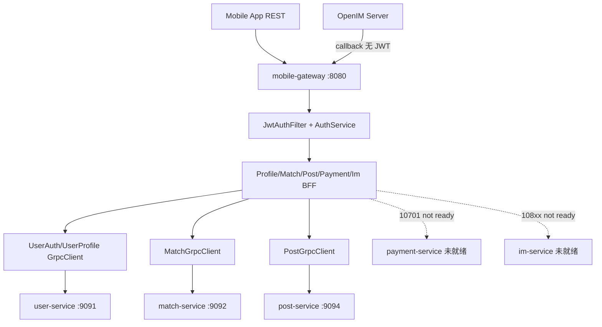

# mobile-gateway 技术架构

## 1. 分层结构

```text
┌─────────────────────────────────────────────────────────┐
│  Controller   REST 入口、Swagger、JWT 已由 Filter 完成   │
├─────────────────────────────────────────────────────────┤
│  BffService   编排、参数校验、VO 转换（无核心业务规则）  │
├─────────────────────────────────────────────────────────┤
│  GrpcClient   deadline、metadata、异常映射               │
├─────────────────────────────────────────────────────────┤
│  Converter    ProtoAdapter / ReqBuilder                   │
├─────────────────────────────────────────────────────────┤
│  Security     JwtAuthFilter / Issuer / Blacklist          │
├─────────────────────────────────────────────────────────┤
│  Support      GatewayGrpcMetadataSupport / ParamSupport   │
├─────────────────────────────────────────────────────────┤
│  Exception    GatewayErrorCode / GlobalExceptionHandler   │
└─────────────────────────────────────────────────────────┘
```

## 2. 架构图（Mermaid）



## 3. 为什么是 BFF，不是普通 Gateway

| 普通网关 | 本项目的 BFF |
| --- | --- |
| 路由 + 限流 | REST↔gRPC 转换、聚合 VO |
| 无业务状态 | 持有 Auth 表、JWT、短信 mock |
| 统一鉴权可选 | **必须**解析 JWT 得到 callerUserId |
| 不感知 proto | 强依赖 user/match/post proto 契约 |

## 4. MVC + JWT + gRPC 职责边界

- **Controller**：取 callerUserId（`CallerUserResolver`），调 BffService，包装 `Result<T>`。
- **JwtAuthFilter**：保护 `/api/v1/**`（Auth 公开接口除外）；`/callback/openim/**` 跳过。
- **GrpcClient**：注入 caller 身份（request 字段或 metadata），捕获 `StatusRuntimeException` → `GatewayGrpcExceptionMapper`。
- **Payment/Im BffServiceImpl**：无 gRPC，prod 直接 not ready。

## 5. 下游调用关系

| 模块 | Client | callerUserId 传递方式 |
| --- | --- | --- |
| Auth 登录 | UserAuthGrpcClient | 登录前无 caller；登录后 gateway 签发 JWT |
| Profile/Home/Upload | UserProfileGrpcClient | request 内 userId 字段（来自 JWT） |
| Match | MatchGrpcClient | **proto request.caller_user_id** |
| Post | PostGrpcClient | **gRPC metadata x-user-id** |
| Payment | 无 | N/A（not ready） |
| IM | 无 | N/A（not ready） |

## 6. 关键横切能力

- **GatewayGrpcMetadataSupport**：x-user-id / x-trace-id / x-device-id（Post 已用）。
- **GatewayGrpcExceptionMapper**：gRPC Status → GatewayErrorCode。
- **Profile 策略**：`PaymentBffServiceImpl` / `ImBffServiceImpl` → `!mock & !test`；Mock* → `mock | test`。
