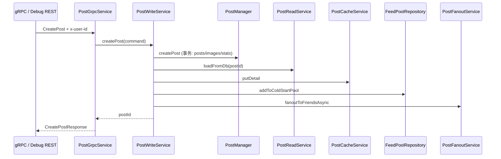
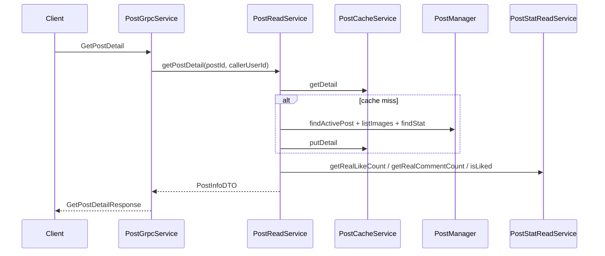
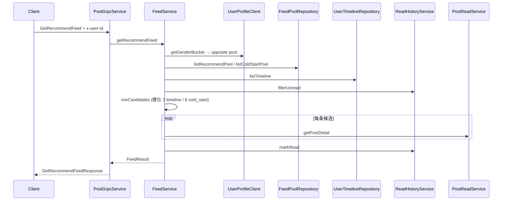

# PostService 核心调用链

## CreatePost



---

## GetPostDetail



---

## ActionLike

```text
gRPC/Debug → PostLikeService.actionLike
  → PostManager.findActivePost
  → PostLikeManager.upsertIfChanged (ON CONFLICT)
  → [状态变化] PostStatDeltaRepository.incrementLikeDelta
  → PostCacheService.evictDetail
```

---

## CreateComment

```text
gRPC/Debug → PostCommentService.createComment
  → PostManager.findActivePost
  → BusinessIdGenerator.nextId → PostCommentManager.insertComment
  → PostStatDeltaRepository.addCommentToWindow + incrementCommentDelta
  → PostCacheService.evictDetail
```

---

## ListComments

```text
gRPC/Debug → PostCommentService.listComments
  → PostStatDeltaRepository.listCommentIdsFromWindow (Redis ZSet)
  → [窗口不足] PostCommentManager.listCommentsFromDb
  → 组装 CommentInfoDTO + nextCursor
```

---

## GetRecommendFeed



---

## LikeFlushJob / CommentFlushJob

```text
@Scheduled(60s) → PostStatFlushService
  → PostStatDeltaRepository.listUpdatedPostIds
  → PostStatDeltaRepository.atomicTakeLikeDelta / atomicTakeCommentDelta (Lua)
  → PostStatManager.addLikeCount / addCommentCount
  → PostStatDeltaRepository.removeUpdatedPostIfIdle
```

---

## FeedScoreJob

```text
@Scheduled(300s) → FeedPoolRebuildService.rebuildAllRecommendPools
  → PostManager.listRecentActivePosts (近 3 天)
  → PostStatReadService 实时计数 + FeedScoreService 算分
  → UserProfileClient.batchGetGenderBuckets
  → FeedPoolRepository.rebuildRecommendPool (tmp → rename)
```

---

## 删帖 / 删评论（简述）

**DeletePost：** PostWriteService → 校验作者 → softDeletePost → evictDetail

**DeleteComment：** PostCommentService → 校验作者 → 逻辑删 → ZSet 移除 → comments delta -1
